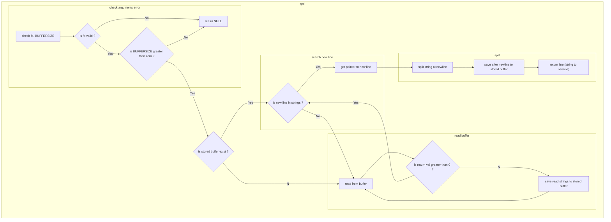

# GET_NEXT_LINE

read from fd, and return each line per gnl() runs.

## gnl_test.sh

when you run this shell script, 

First, compile will start with BUFFER_SIZE = 0,and will return NULL.

After that, compile with BUFFER_SIZE = 1, 42, 1024 will test by 14 txt files.

These tests outputs "cat {file}", then outputs "./a.out {file}".

Compare both outputs.

## gnl_main.c
gnl_main.c includes cases fd=0 and multi fds Comment-Outed.

## make
make b0 compiles with BUFFER_SIZE=0.

make b1 compiles with BUFFER_SIZE=1.

make b2 compiles with BUFFER_SIZE=42.

make b3 compiles with BUFFER_SIZE=1024.
